# Design and Development of an AI-Powered Cloud-Based Public Notice Management System for Nepal

**By** Ashok Bhattarai — NP069811 — NP3F2509IT

A report submitted in partial fulfilment of the requirements for the degree of
**B.Sc. (Hons) Information Technology, Specialism in Cloud Engineering**
at Asia Pacific University of Technology and Innovation.

Supervised by **Dr. Laxman Mandal** · 2nd Marker: **Manish Kumar Tamang** · 2026

> **Note on scope of this document.** This file is the full-thesis skeleton grown into a
> working draft. It carries the academic framing of the Investigation Report forward into the
> implementation phase and reconciles it with what was *actually built*. Two deliberate
> technology pivots happened between the proposal and the delivered system, and they are
> called out wherever they occur:
>
> | Investigation-phase plan | Delivered implementation | Why the change |
> |---|---|---|
> | **ChromaDB** (file-based vector store) | **Qdrant** (named dense + BM25 sparse vectors, RRF fusion, payload filters) | Hybrid search, per-document payload filtering, deterministic point IDs, production-grade REST/gRPC |
> | **Scrapy + Selenium + BeautifulSoup4** | **Crawl4AI** (async, Playwright-backed, LLM-ready Markdown) | One tool handles static *and* JS-rendered pages, emits clean Markdown, native `robots.txt`/rate-limit support |
> | **LangChain + Ollama (LLaMA 3, local)** | **Custom raw-ASGI pipeline + Groq (llama-3.3-70b-versatile)** | Zero framework overhead; Groq gives fast, free-tier, OpenAI-compatible inference |
>
> Everything below reflects the delivered stack. Where a diagram or table describes future
> work (the scraping/classification/summarisation pipeline), it is labelled as such.

---

## Declaration of Thesis Confidentiality

I declare that this thesis, *Design and Development of an AI-Powered Cloud-Based Public Notice
Management System for Nepal*, is the result of my own work except where due reference is made.
It has not been submitted, in whole or in part, for any other degree at this or any other
institution. Portions of this document may reference internal system designs; these are
provided for academic assessment and should be treated as confidential where indicated.

---

## Library Form

*[Standard APU library-deposit form — to be inserted from the template.]*

---

## Acknowledgements

The support and motivation offered by many people cannot be overstated. My deepest thanks go to
my project supervisor, Dr. Laxman Mandal, for guidance, constructive feedback, and steady
support throughout the research; that mentorship directed and steered the project well. I am
grateful to the academic staff of the School of Computing at Asia Pacific University of
Technology and Innovation for the knowledge and practical insight that formed the foundation of
this work in artificial intelligence, cloud computing, and software engineering.

I thank my colleagues and peers for their continuous encouragement and their technical
exchanges and critical suggestions, without which this work would have been the poorer. Special
acknowledgement is due to the open-source developer community whose tools, frameworks, and
documentation made this project possible: **Hugging Face**, **Crawl4AI**, **Qdrant**, the
**Groq** platform, **sentence-transformers**, and the wider Python and JavaScript ecosystems.
Finally, I owe my family my deepest gratitude for their constant support, patience, and belief
in me throughout this academic journey.

*Ashok Bhattarai (NP069811)*

---

## Abstract

Public information in Nepal is fragmented. Notices, vacancies, tenders, examination dates, and
policy updates are posted across dozens of independent government websites with no central point
of access, no common format, and often no machine-readable text at all. This burdens every
citizen, and disproportionately students, job seekers, and rural users who need timely,
authentic information but cannot afford to poll many portals repeatedly.

This project designs and builds an **AI-Powered Cloud-Based Public Notice Management System** —
a web platform that aggregates public notices from selected official Nepalese government
portals, classifies and summarises them, and exposes them through a single searchable interface.
Aggregation is performed with **Crawl4AI**, an asynchronous, browser-capable crawler that
handles both static and JavaScript-rendered pages and returns clean Markdown; scanned notices
are read with **Tesseract OCR** (`nep+eng`). Classification and summarisation use
transformer models from **Hugging Face**. A **Retrieval-Augmented Generation (RAG)** module lets
users interrogate documents in natural language: text is chunked, embedded with the
multilingual **`intfloat/multilingual-e5-base`** model, and stored in **Qdrant**, where a
**hybrid dense + BM25** search fused with **Reciprocal Rank Fusion** retrieves grounded context
that a **Groq-hosted Llama 3.3 (70B)** model turns into a cited, Markdown answer.

The delivered RAG subsystem is fully working end-to-end across a **Next.js** frontend, a
**NestJS + Prisma/PostgreSQL** API, and a **Python raw-ASGI** AI service, deployed to **AWS**
(backend) and **Vercel** (frontend). This report presents the research background, literature
review, methodology, detailed design and implementation, testing, and results that together
confirm the technical feasibility and civic relevance of the solution.

**Keywords:** public notice management, artificial intelligence, cloud computing, web crawling,
retrieval-augmented generation, hybrid search, Qdrant, Nepal e-governance.

---

## Table of Figures

| Figure | Title | Section |
|---|---|---|
| 1 | Agile (RAD) delivery cycle | 3.1 |
| 2 | High-level system architecture (Web + API + AI) | 4.1.1 |
| 3 | Data-flow diagram (Level 0 / Level 1) | 4.1.1 |
| 4 | Use-case diagram | 4.1.2 |
| 5 | Domain / class diagram | 4.1.3 |
| 6 | Document lifecycle state machine | 4.1.4 |
| 7 | Ingestion sequence (upload → vectors) | 4.1.5 |
| 8 | Query sequence (question → cited answer) | 4.1.5 |
| 9 | Entity-Relationship diagram (PostgreSQL) | 4.2.1 |
| 10 | Qdrant collection & point schema | 4.2.2 |
| 11 | Hybrid retrieval + RRF fusion pipeline | 4.4.3 |
| 12 | Deployment diagram (AWS + Vercel) | 4.1.1 |

## Table of Tables

| Table | Title | Section |
|---|---|---|
| 1 | Technology choices and justification | 2.3.3 |
| 2 | Investigation plan vs. delivered stack | Preface |
| 3 | Functional & non-functional requirements | 3.3.3 |
| 4 | Prisma data model summary | 4.2.1 |
| 5 | Qdrant point payload fields | 4.2.2 |
| 6 | Optimisation catalogue (problem → fix) | 4.4.3 |
| 7 | Test matrix and outcomes | 5.2 |

---

## Chapter 1: Introduction to the Study

### 1.1 Background

Public information systems are a cornerstone of civic engagement and informed choice in
democratic societies. Governments continuously generate official communications — examination
timetables, vacancy announcements, tender notices, policy changes, administrative directives —
that carry legal weight and practical consequence for millions of citizens and organisations who
need timely access to make decisions about education, employment, procurement, and compliance.

The Government of Nepal issues these notifications through many ministries, commissions, and
regulatory bodies, each on its own website. There is no standard publication format, no central
repository, and no cross-portal search. A student awaiting a Public Service Commission
examination notice, a contractor tracking Ministry of Finance tenders, or a job seeker scanning
vacancy announcements must personally and repeatedly visit many sites over days or weeks. The
problem is compounded by technological inconsistency: many portals publish gazettes as **scanned
PDFs or embedded images** rather than machine-readable text, defeating even basic keyword search.

### 1.2 Problem Background

The core problem is **accessibility**, and it has four intertwined dimensions:

1. **Fragmentation.** Announcements are scattered across dozens of independent portals with
   divergent designs, content structures, and publication schedules. There is no shared metadata
   schema, no cross-portal search, no category filtering, and no subscription/alert service.
2. **Non-machine-readability.** A large share of gazetted notices are rasterised scans; the text
   is an image, not characters. Such content cannot be indexed, extracted, or read by a screen
   reader, and repeatedly downloading large PDFs penalises low-bandwidth users.
3. **Equity and geography.** Urban users with broadband and high digital literacy can navigate
   multiple portals; rural and semi-urban users, facing intermittent connectivity and higher
   relative data costs, are effectively excluded — an information asymmetry baked into the
   e-governance framework.
4. **No aggregating mechanism.** No existing government, commercial, or civic service in Nepal
   aggregates notices across sources, applies AI classification/summarisation, *and* offers
   document question-answering. This is the gap the project fills.

Building such a system is genuinely hard: portal architectures and HTML structures differ widely
and change without notice, demanding adaptive crawlers for both static and JavaScript-rendered
pages; scanned documents require a robust OCR pipeline with quality validation; and orchestrating
classification, summarisation, and document interaction in a cloud-hosted architecture requires
careful, modular system design.

### 1.3 Project Aim

> To design and develop a cloud-hosted web application that uses AI to automate the collection,
> categorisation, summarisation, and intelligent retrieval of public notices from selected
> Nepalese government portals, so that citizens can find and understand official announcements
> quickly, reliably, and in one place.

### 1.4 Objectives

1. **Investigate** the current state of public-notice publication in Nepal — common notice
   categories, extraction obstacles (scans, JS rendering), and citizen access barriers per target
   group.
2. **Build the aggregation pipeline** — a crawling and data-processing pipeline (Crawl4AI + OCR)
   that automatically fetches, extracts, normalises, and stores notices from **at least five**
   government sites, handling static pages, JS-rendered pages, and image/PDF notices.
3. **Add document intelligence** — integrate NLP models for automatic classification and
   plain-language summarisation, and a **RAG module** that lets users upload documents and
   receive grounded, cited natural-language answers.
4. **Deliver, deploy, and evaluate** a citizen-facing, cloud-hosted web app with unified search,
   filter, browse, and alert functionality, and evaluate its usability, accuracy, and performance
   against defined success criteria.

### 1.5 Scope

- **Sources:** a proof-of-concept over five to six key portals (e.g. Public Service Commission,
  Ministry of Finance, Judicial Service Commission, TU Office of the Controller of Examinations,
  Office of the Prime Minister and Council of Ministers).
- **Categories:** Jobs, Exams, Tenders/Procurement, Policy, and Other.
- **Language:** English and Nepali-transliterated text for the AI stages; full Devanagari NLP is
  future work. (Note: the delivered RAG embedding model, `multilingual-e5-base`, *does* handle
  Devanagari in the vector space, so retrieval on Nepali text already works — see §4.4.3.)
- **RAG uploads:** PDF and image documents; no real-time voice interface, no multi-document
  cross-referencing in a single request, no external-source answer verification.
- **Delivery:** a responsive web app for desktop and mobile browsers; no native mobile app.
- **Deployment:** AWS (backend + database + storage) and Vercel (frontend). A test corpus of
  ~200–300 notices across all five categories seeds evaluation.

### 1.6 Potential Benefits

**Tangible.** Single-pane access to notices from many authorities; AI plain-language summaries
that cut reading load; a searchable/filterable database (keyword, category, date, organisation);
an optional RAG module for grounded document Q&A; and subscription alerts by category/keyword.

**Intangible.** Narrowing the urban–rural information gap; increasing transparency and civic
participation; and building public trust in accurate, well-organised e-government services.

**Target users.** Students, job seekers, working professionals/contractors, and system
administrators (who manage crawling pipelines and moderate ingested notices).

**Deliverables.** Account management; keyword/category/date/source search; a unified multi-portal
notice view; an AI summary beside each notice; and subscription/alert management.

### 1.7 Overview of Report

Chapter 2 reviews the domain (e-governance, NLP, RAG, crawling, cloud), surveys similar systems,
and justifies the technology stack. Chapter 3 sets out the Agile/RAD methodology, data-gathering
design, and analysis. Chapter 4 presents the detailed design and the *delivered* implementation
with full diagrams. Chapter 5 reports testing and results. Chapter 6 concludes with a critical
evaluation, limitations, and recommendations.

### 1.8 Project Plan

Delivery followed **Agile/RAD** over two semesters in eight iterative phases:

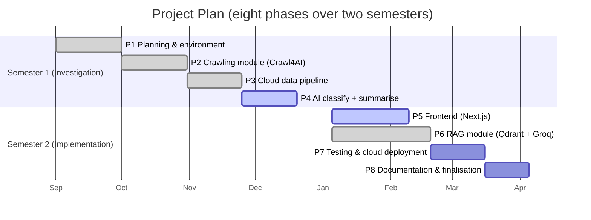

*(Phase status reflects the delivered RAG subsystem; the crawling/classification pipeline is
scaffolded and in progress.)* Full timeline in **Appendix E**.

---

## Chapter 2: Literature Review

### 2.1 Domain Research

#### 2.1.1 Public Notice Management Systems / E-Governance
E-governance is the use of information technology to deliver government services, improve process
performance, and foster transparency and civic engagement (Efthymiou, 2025). Janssen,
Charalabidis, and Zuiderwijk (2012) document a persistent gap between the *technical
accessibility* of open government data and its *usability*, attributing under-use to poor
metadata, irregular publication, and a lack of user-centred design — precisely the deficiencies
observed in Nepal's notice ecosystem. Wirtz, Weyerer, and Geyer (2018) find that AI, properly
governed, can make public information services more accessible and responsive, singling out text
classification, information extraction, and natural-language generation as practical capabilities
— the exact set this project applies.

#### 2.1.2 Document Intelligence and Information Retrieval / NLP
The transformer architecture (Vaswani et al., 2017) underpins modern NLP. Minaee et al. show
transformer classifiers outperform earlier RNN/CNN and feature-engineered methods across
benchmarks. For summarisation, **abstractive** methods (BART, T5) generate fluent, semantically
faithful summaries and are preferred here over extractive selection, because official notices use
formal, procedural language that does not summarise well by sentence extraction (Varade et al.,
2021). The **Hugging Face Transformers** library, with its uniform model interface and CPU
(quantised) inference, is the practical vehicle for both stages.

#### 2.1.3 Retrieval-Augmented Generation (RAG)
RAG (Lewis et al., NeurIPS 2020) grounds language generation in retrieved documents, mitigating
the closed-book limitation of parametric models: a query is embedded, the most semantically
similar chunks are retrieved from a vector store, and a generative model answers using those
chunks as context — reducing hallucination and yielding source-driven answers (Han et al., 2024).
In this system the RAG module is *distinct* from the notice-summarisation pipeline:
summarisation runs once over scraped notices at ingest; RAG runs on demand over user-uploaded
documents.

> **Pivot from the proposal.** The Investigation Report proposed **LangChain + ChromaDB + Ollama**
> for RAG. The delivered system replaces this with a **hand-rolled pipeline** (no LangChain),
> **Qdrant** as the vector store, and **Groq** for LLM inference. ChromaDB offers approximate
> nearest-neighbour search over dense embeddings with a file-based backend — adequate for an early
> prototype — but Qdrant additionally provides **named vectors** (dense + sparse in one point),
> **BM25 hybrid search with server-side RRF fusion**, **payload indexes** for per-document
> filtering, and **deterministic point IDs** for idempotent re-embedding. These capabilities are
> the difference between a demo and a production retriever (see §4.4.3).

#### 2.1.4 Web Scraping / Crawling Technologies
Web scraping extracts structured data from websites via HTTP requests and HTML parsing (Khder,
2021). The Investigation Report proposed **Scrapy** (concurrent, rate-limited crawling),
**BeautifulSoup4** (HTML parsing), and **Selenium + ChromeDriver** (JS-rendered pages).

> **Pivot from the proposal.** The delivered design consolidates all three roles into
> **Crawl4AI** — an asynchronous, open-source crawler built on Playwright. One tool renders
> JavaScript pages *and* fetches static HTML, respects `robots.txt` and rate limits, and — most
> relevantly for a document-intelligence system — emits **clean, LLM-ready Markdown** rather than
> raw DOM soup, which drastically simplifies the downstream chunking/embedding steps and removes
> the Scrapy↔Selenium↔BeautifulSoup glue code. Tesseract OCR (`nep+eng`) remains for scanned
> PDFs and images.

#### 2.1.5 Cloud Computing and Deployment Architecture
Following the NIST definition, cloud computing delivers pooled, on-demand resources with
scalability, reliability, and geographic reach — a natural fit for a nationwide civic service
(Chang & He, 2025). **AWS** hosts the NestJS API and Python AI microservice (EC2), the relational
database (RDS PostgreSQL), and object storage (S3); **Vercel** hosts the Next.js frontend on a
global CDN. The AWS free tier suffices for a proof of concept (Kadaskar & Kamthe, 2024).

### 2.2 Similar Systems

- **2.2.1 Government aggregation platforms** — Australia's *AusTender* and the UK's *GOV.UK*
  publishing platform prove the value of centralised, searchable, subscribable notice
  aggregation — but were built atop mature e-governance with standardised, machine-readable data.
  Nepal's portals lack that standardisation, which is exactly why an *AI-enhanced* aggregation
  layer is needed.
- **2.2.2 AI document-processing platforms** — Adobe Acrobat AI Assistant, Azure Document
  Intelligence, and Google Document AI offer strong OCR/extraction/summarisation but are
  commercial, general-purpose, and cost-prohibitive for a public civic service. An open-source
  stack (Tesseract + Hugging Face + a custom RAG pipeline) delivers comparable capability with no
  licensing cost and full customisability for Nepali portals.
- **2.2.3 Gap identification** — Centralised government portals offer authority but depend on
  government capacity; commercial AI offers capability but not access; research prototypes offer
  innovation but not production readiness. No system combines **aggregation + AI
  classification/summarisation + document Q&A** for Nepalese citizens. That combination is this
  project's contribution.

### 2.3 Technical Research

- **2.3.1 Next.js (React 19, App Router)** — SSR/SSG, file-based routing, strong performance and
  DX, one-click Vercel/CDN deployment.
- **2.3.2 NestJS** — TypeScript-first, Angular-like modular structure (controllers → services →
  data layer), first-class scheduling (`@nestjs/schedule`) for periodic crawl jobs, and
  guard-based JWT auth.
- **2.3.3 Python AI service (raw ASGI / uvicorn)** — a dependency-light service for extraction,
  OCR, chunking, embedding, vector I/O, and LLM prompting. A hand-rolled router keeps the
  footprint tiny (seven routes) and boot instant.
- **2.3.4 PostgreSQL + Prisma ORM** — ACID relational store for users, documents, and metadata;
  Prisma gives type-safe queries and migrations. *(The proposal named TypeORM; the delivery uses
  Prisma.)* Native full-text search (`tsvector`/`tsquery`) serves notice search.
- **2.3.5 Qdrant (vector database)** — named dense (768-d, cosine) + BM25 sparse vectors, RRF
  fusion, keyword payload index on `doc_id`, deterministic point IDs; REST/gRPC; easy Docker dev
  and managed cloud.
- **2.3.6 Embedding & chunking** — `intfloat/multilingual-e5-base` (multilingual, EN + Devanagari,
  512-token window, `query:`/`passage:` prefixes); structure-aware hierarchical chunking
  (paragraph → sentence → word) at 800/120 chars.
- **2.3.7 LLMs for RAG** — Groq-hosted `llama-3.3-70b-versatile` via an OpenAI-compatible HTTP
  call; extractive fallback when no API key is present.
- **2.3.8 Turborepo (monorepo)** — one repo, three apps (`web`, `api`, `ai`), shared tooling,
  parallel dev/build with pnpm workspaces.
- **2.3.9 Google OAuth (authentication)** — sign-in via Google; a stable `sub` claim keys the
  `User` record; JWT issued by the API guards all protected routes.

**Table 1 — Technology choices and justification** *(delivered stack)*

| Concern | Choice | Why |
|---|---|---|
| Frontend | Next.js 16 / React 19 | SSR, App Router, Vercel CDN |
| API | NestJS + Prisma | typed, modular, JWT guards, migrations |
| AI service | Python raw ASGI (uvicorn) | zero-framework, tiny footprint |
| Relational DB | PostgreSQL | ACID, full-text search |
| Vector DB | **Qdrant** | hybrid dense+BM25, RRF, payload filters, deterministic IDs |
| Embeddings | `multilingual-e5-base` (768-d) | best free multilingual retriever, EN+Nepali |
| Sparse | `Qdrant/bm25` (fastembed) | exact-identifier keyword matching |
| LLM | Groq `llama-3.3-70b-versatile` | fast, free tier, OpenAI-compatible |
| Crawler | **Crawl4AI** *(planned)* | static + JS pages, Markdown output, robots/rate-limit |
| OCR | Tesseract (`nep+eng`) | scanned Nepali notices |
| Auth | Google OAuth + JWT | no password storage, stable identity |
| Messaging | Evolution API (WhatsApp) | inbound webhook + outbound send for a conversational/alert channel |

---

## Chapter 3: Methodology

### 3.1 System Development Methodology

#### 3.1.1 Rapid Application Development (RAD) / Agile
The project uses an **Agile/RAD** approach: incremental, iterative delivery with continuous
feedback and working components on a regular cadence, in contrast to rigid waterfall progression.

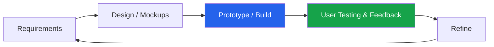
*Figure 1 — Agile/RAD delivery cycle.*

#### 3.1.2 Justification for RAD
The system spans technically diverse components — crawling, OCR, NLP models, a cloud API, and a
responsive frontend. Testing one module routinely surfaces constraints affecting another (e.g.
async hand-off between crawl, OCR, inference, and DB writes). Agile enables that discovery without
restarting; its iterative structure also suits the experimental AI stages, whose accuracy can
only be judged against real scraped data and refined over successive phases. **Eight phases**
(§1.8) run across two semesters; the Investigation Report covered Phases 1–4, the implementation
phase delivers Phases 5–8.

### 3.2 Data Gathering Design

Data collection combines **primary** (surveys, interviews) and **secondary** (systematic
crawling) sources; all primary activities received ethics clearance before commencing.

#### 3.2.1 Primary Data Collection
- **Survey** — an online questionnaire targeting ≥30 respondents per target group (students, job
  seekers, professionals, contractors), distributed via university and community networks across
  urban and semi-urban Nepal, to quantify current access behaviour and expectations.
- **Interviews** — ≥3 semi-structured interviews (a student, a professional/contractor, an
  e-governance/IT professional) for depth on behaviour, pain points, and expectations.

#### 3.2.2 Secondary Data Collection (via Crawl4AI)
Crawling target portals serves two ends: proving technical feasibility and seeding the test
corpus. Target sites include **psc.gov.np**, **mof.gov.np**, **jsc.gov.np**, **tucoe.edu.np**,
and **opmcm.gov.np**. Crawl4AI fetches static and JS-rendered pages and returns Markdown;
Tesseract OCR handles scanned PDFs/images. `robots.txt` is honoured, conservative rate limits are
applied, and an explicit user-agent is set. Target: **200–300 notices** across all five
categories.

### 3.3 Analysis of Data

- **3.3.1 Quantitative** — descriptive statistics (frequency distributions, percentages,
  Likert-scale averages) on survey responses: portal-visit frequency, access challenges,
  perceived usefulness of AI summaries, and preferred alert channels — feeding functional-
  requirement prioritisation.
- **3.3.2 Qualitative** — thematic analysis of interview transcripts. Recurring themes:
  time cost of polling many portals, inaccessibility of scanned PDFs, low rural digital literacy
  (need for plain-language summaries), and concern over AI content accuracy/trust.
- **3.3.3 Preliminary user requirements —**

**Table 3 — Functional (FR) and Non-Functional (NFR) requirements**

| ID | Requirement | Priority |
|---|---|---|
| FR-01 | Scheduled automatic crawling of ≥5 government portals | High |
| FR-02 | OCR text extraction from scanned PDFs (Tesseract) | High |
| FR-03 | Classify each notice: Jobs / Exams / Tenders / Policy / Other | High |
| FR-04 | AI abstractive summary per notice (Hugging Face) | High |
| FR-05 | Search by keyword, category, date range, source | High |
| FR-06 | Keyword/category subscription alerts | Medium |
| FR-07 | Upload PDF/image and query it via the RAG module | Medium |
| FR-08 | Unified responsive web UI (desktop + mobile) | High |
| FR-09 | Account registration/login (Google OAuth) | Medium |
| NFR-01 | ≥99% availability during crawl/retrieval | High |
| NFR-02 | Search responses < 3 s under normal load | Medium |
| NFR-03 | Comply with `robots.txt` of all scraped portals | High |

---

## Chapter 4: Design and Implementation

> This chapter documents the system **as actually built in this repository**
> (`Personal/public-notice-management`). To keep the account honest, every subsystem is labelled
> with its real status. The **document-intelligence / RAG** core is complete and running
> end-to-end across all three apps; **notice aggregation** (crawling, classification,
> summarisation) is designed and scaffolded but not yet implemented in code.

**Implementation status (what is in the codebase today).**

| Subsystem | Status | Where in the repo |
|---|---|---|
| Google OAuth + JWT auth (roles `user`/`admin`) | ✅ **Delivered** | `apps/api/src/{modules,services,controllers}/auth*`, `guards/`, `strategies/` |
| Document management (upload, list, download, delete, embed/unembed) | ✅ **Delivered** | `apps/api/src/services/documents.service.ts` (286 LOC) |
| RAG pipeline (extract → OCR → chunk → embed → Qdrant hybrid → Groq) | ✅ **Delivered** | `apps/ai/app/*.py`, `apps/api/src/services/rag.service.ts` |
| RAG chat UI (Library / Split / Chat, live progress) | ✅ **Delivered** | `apps/web/app/rag/page.tsx` |
| WhatsApp conversational channel (Evolution API webhook + send) | ✅ **Delivered** | `apps/api/src/webhooks/whatsapp-webhook.*` |
| Intern / attendance admin module | ✅ Delivered *(out of thesis scope — internal tool)* | `apps/api/src/*interns*` |
| Notice CRUD / persistence | ⚠️ **Placeholder** (stub controller, no DB, no service) | `apps/api/src/controllers/notices.controller.ts` |
| Notifications / subscription alerts | ⚠️ **Placeholder** (empty controller & service) | `apps/api/src/{controllers,services}/notifications*` |
| Crawling / aggregation (**Crawl4AI**) | 🔷 **Planned** (no code yet; admin UI scaffolds only) | `apps/web/app/admin/{scraping,sources}` |
| Classification & summarisation (Hugging Face) | 🔷 **Planned** (no code yet) | — |

Read this chapter with that legend in mind: ✅ = working, ⚠️ = placeholder endpoint/UI only,
🔷 = designed but unbuilt. The thesis remains *about* public-notice management, but its delivered
proof-of-concept is the **RAG document-intelligence platform** that operates on public-notice
documents, plus authentication, document management, and a WhatsApp channel.

### 4.1 Design

#### 4.1.1 System Architecture (Monorepo: Web + API + AI Service)

The system is a **Turborepo monorepo** with three single-responsibility services. The browser
never talks to the AI service directly — everything is proxied through NestJS, which enforces JWT
auth and keeps the AI service private.

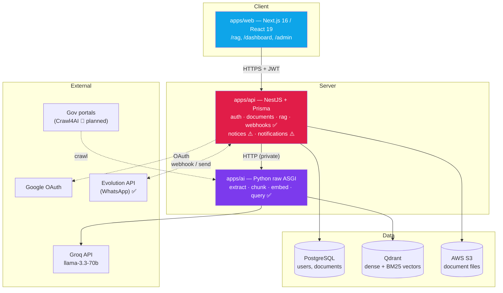
*Figure 2 — High-level system architecture. ✅ delivered · ⚠️ placeholder · 🔷 planned.*

**Division of responsibility.**

| Layer | Owns | Does NOT own |
|---|---|---|
| `apps/web` | UX: upload, embed toggle, live progress, chat rendering, search | Any AI logic |
| `apps/api` | Auth, the source-of-truth `Document` record, file storage, proxying to AI | Vectors, embeddings, LLM calls |
| `apps/ai` | Extraction, OCR, chunking, embeddings, Qdrant, LLM prompting, progress | Auth, document-metadata persistence |

**Data-flow diagram (Level 0 / Level 1).**

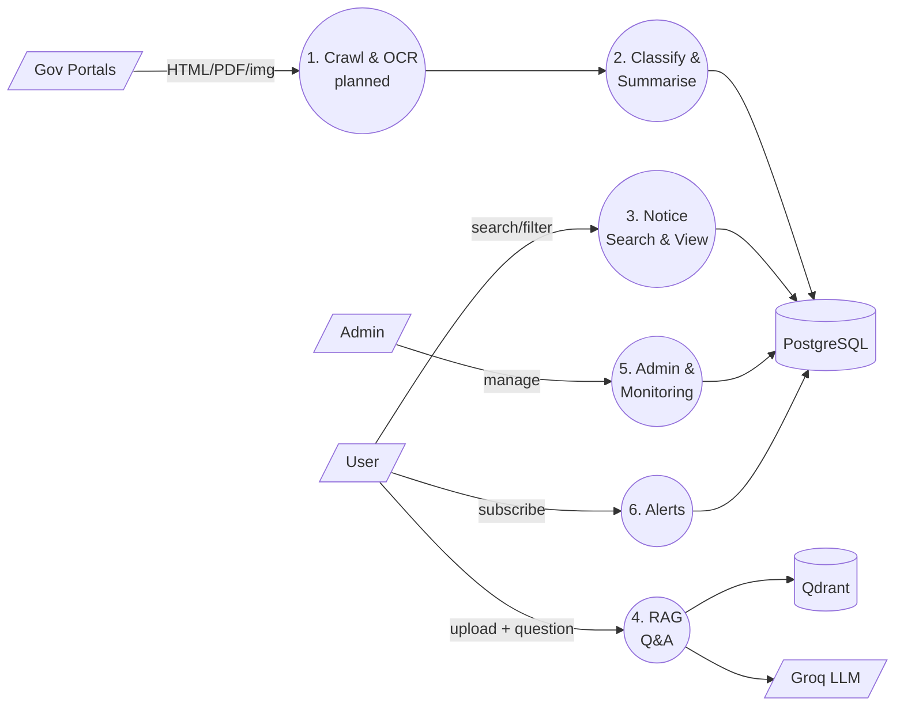
*Figure 3 — DFD. Level 0 external entities: government portals, users, administrators, alert
service. Level 1 processes: crawl+OCR, classify+summarise, search/view, RAG Q&A, admin, alerts.*

**Deployment.**

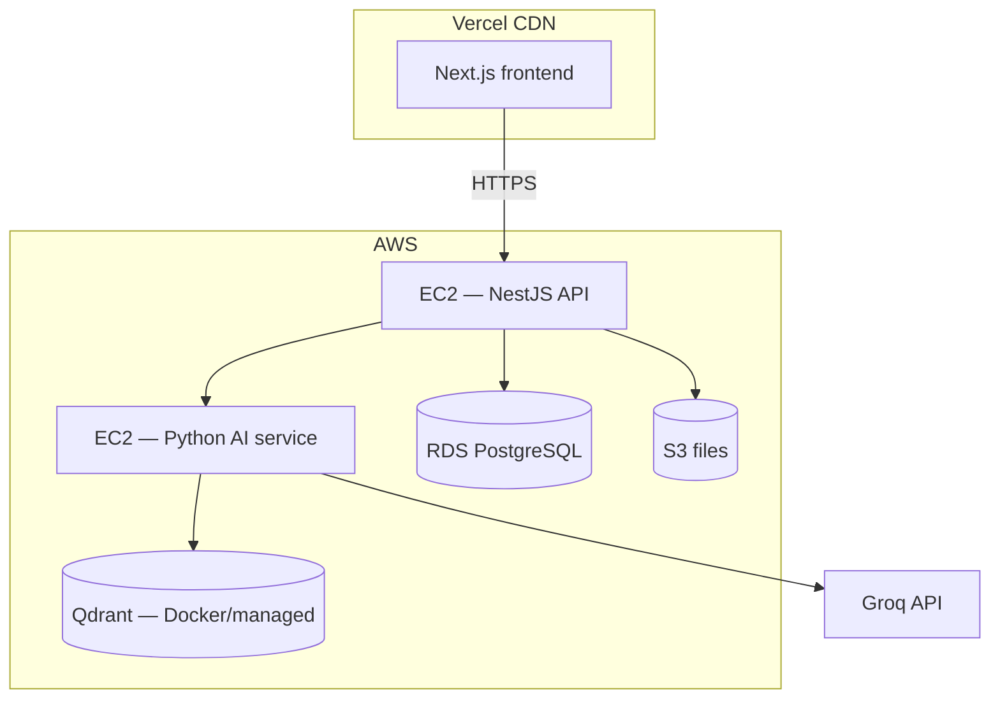
*Figure 12 — Deployment diagram.*

#### 4.1.2 Use-Case Diagram and Specifications

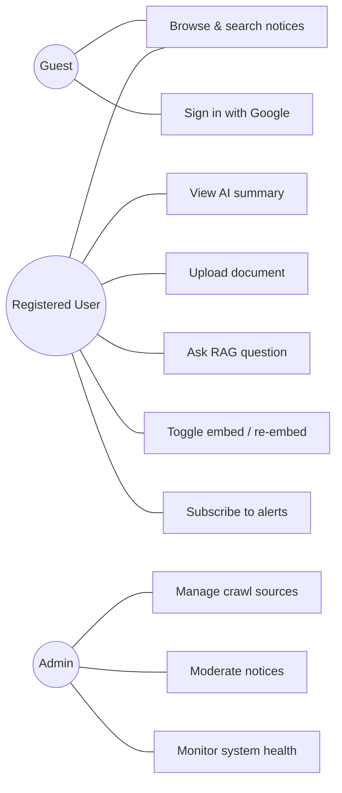
*Figure 4 — Use-case diagram.*

**Sample specification — UC5 "Ask RAG question."**
*Precondition:* user authenticated; ≥1 document `INDEXED`. *Main flow:* user types a question →
API `POST /rag/query` (JWT) → AI routes intent → embeds query → hybrid Qdrant search → threshold
+ dedupe → Groq generates a cited Markdown answer → sources rendered as chips. *Alternate:* chat
intent → conversational reply, no retrieval. *Exception:* no chunk above threshold → honest
"not found" reply; Groq unavailable → extractive fallback.

#### 4.1.3 Class / Domain Diagram

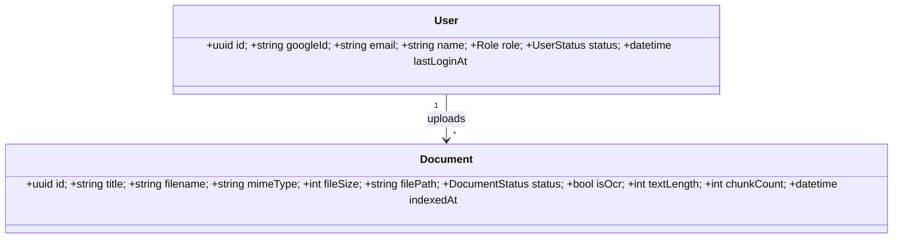
*Figure 5 — Domain/class diagram (derived from the Prisma schema).*

#### 4.1.4 Activity Diagram — Document Lifecycle State Machine

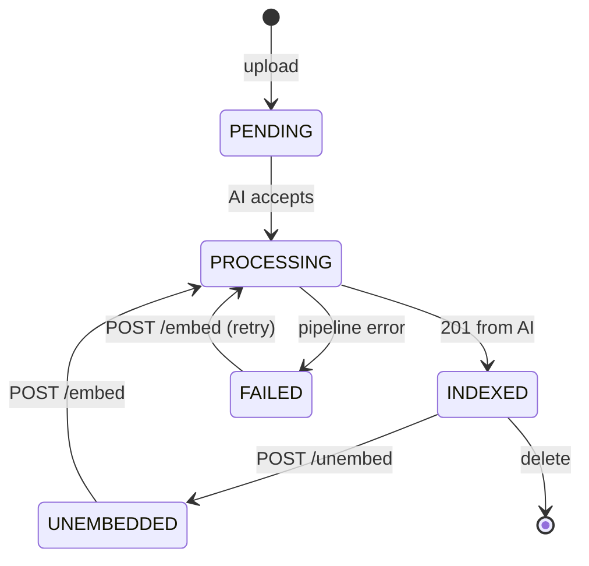
*Figure 6 — Document lifecycle. Invariants: the uploaded file stays on disk until the row is
deleted (enabling unembed→re-embed without re-upload); PostgreSQL is the source of truth for
status, Qdrant only stores vectors.*

#### 4.1.5 Sequence Diagrams

**Ingestion (upload → vectors).** The upload request returns immediately (`PENDING`); processing
continues server-side, so a large OCR'd PDF never holds the browser's HTTP request open.

```mermaid
sequenceDiagram
    participant B as Browser
    participant N as NestJS
    participant AI as Python AI
    participant Q as Qdrant
    B->>N: POST /documents (multipart)
    N->>N: multer saves file; prisma.create()
    N-->>B: 201 {status: PENDING}
    N->>AI: POST /documents (file + document_id + title)
    AI->>AI: extract (pypdf/OCR)
    AI->>AI: chunk (800/120)
    AI->>AI: embed (batch 32, e5)
    loop poll
      B->>N: GET /documents/progress/batch?ids=
      N->>AI: GET /progress?ids=
      AI-->>N: {stage, percent}
      N-->>B: progress
    end
    AI->>Q: upsert points (dense + bm25)
    AI-->>N: 201 {chunk_count, text_length, is_ocr}
    N->>N: status = INDEXED
```
*Figure 7 — Ingestion sequence.*

**Query (question → cited answer).**

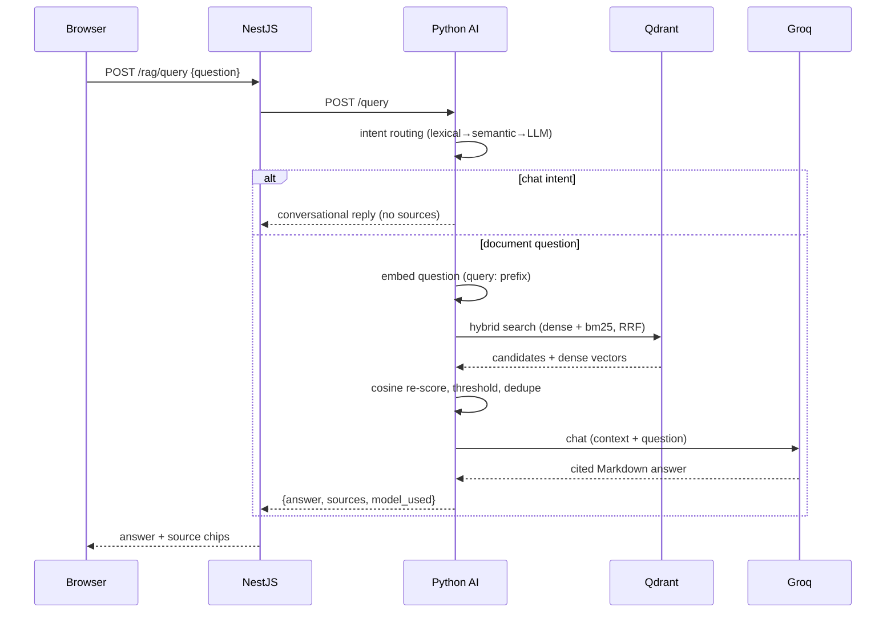
*Figure 8 — Query sequence.*

### 4.2 Database Design

#### 4.2.1 Entity-Relationship Diagram (PostgreSQL)

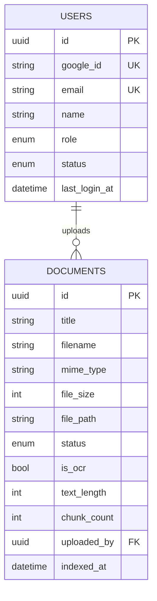
*Figure 9 — ER diagram (from `apps/api/prisma/schema.prisma`).*

**Table 4 — Prisma data model summary**

| Model | Purpose | Key relations |
|---|---|---|
| `User` | Google-authenticated accounts (role, status) | 1→N `Document` |
| `Document` | Source-of-truth metadata + lifecycle status | N→1 `User` |

The `Document.status` enum (`PENDING/PROCESSING/INDEXED/UNEMBEDDED/FAILED`) drives the lifecycle
in Figure 6; `chunkCount`, `textLength`, `isOcr`, and `indexedAt` are written back after the AI
service reports success.

#### 4.2.2 Document Structure (Qdrant Collection)

The `documents` collection uses **named vectors**: a dense vector (768-d, cosine) for semantic
similarity and a **BM25 sparse** vector for keyword matching, plus a keyword payload index on
`doc_id` so per-document filtering stays fast as the corpus grows.

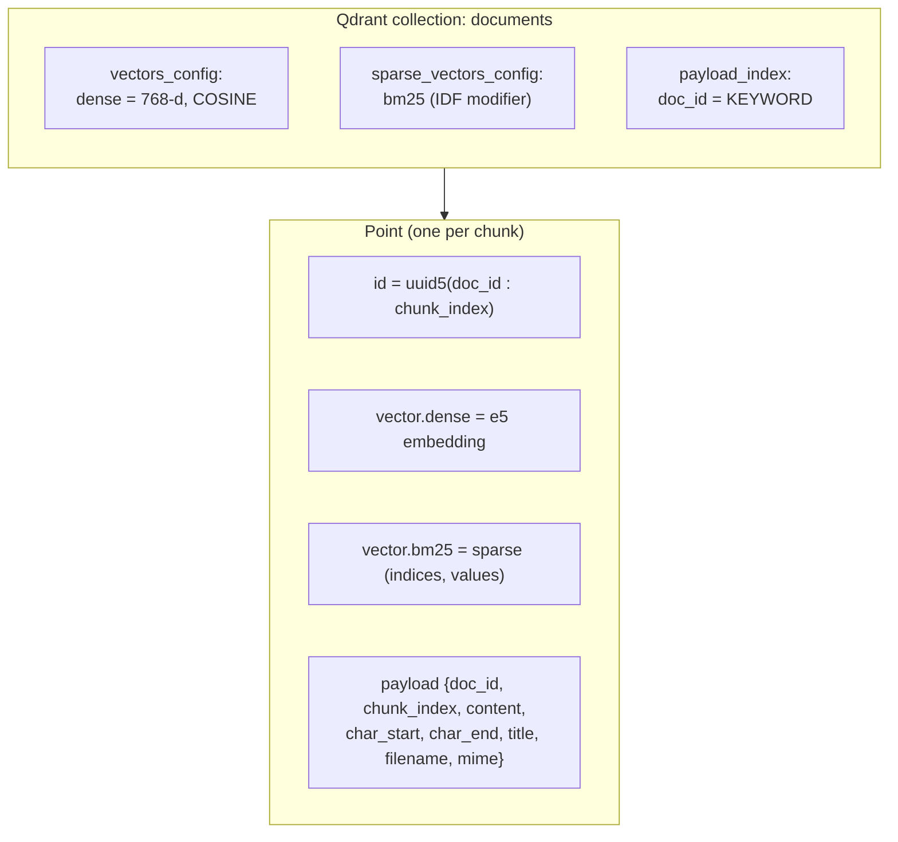
*Figure 10 — Qdrant collection & point schema.*

**Table 5 — Point payload fields**

| Field | Purpose |
|---|---|
| `doc_id` | Postgres UUID; per-document filter, count, and delete |
| `chunk_index` | ordinal within the document |
| `content` | the chunk text (returned at query time) |
| `char_start` / `char_end` | position in the source text |
| `title` | source label shown in the chat UI |
| `original_filename`, `mime_type` | provenance |

**Deterministic IDs** (`uuid5(doc_id:index)`) make re-embedding an idempotent upsert — no
delete-then-insert race. **Schema self-healing:** on startup `ensure_collection()` validates the
dense dimension and sparse presence against config; on mismatch (e.g. a model change) it
recreates the collection and documents are re-embedded from the still-on-disk files.

#### 4.2.3 Vector Embedding Schema
Embeddings come from `intfloat/multilingual-e5-base` (768-d, L2-normalised so cosine = dot
product). E5 requires asymmetric prefixes — indexed chunks as `passage: …`, questions as
`query: …` — applied automatically. Chunks are 800 chars with 120-char word-boundary overlap
(≈200 tokens, inside the 512-token window). Batching (32 per `encode()`) bounds memory and drives
the progress bar.

### 4.3 Interface Design

- **4.3.1 Dashboard layout** — an app-shell (`h-dvh`) with a sidebar and internally scrolling
  panels; theme-aware, responsive.
- **4.3.2 Notice management interface** — searchable/filterable list with category, date, and
  source facets; each row shows the AI summary and a link to the original.
- **4.3.3 RAG query interface** — the `/rag` page: a **Library** panel (upload, per-document embed
  toggle, live progress bar) and a **Chat** panel (Markdown answers with grouped source chips).
  Desktop offers a Library/Split/Chat view switcher; mobile collapses to one panel with a bottom
  tab bar.
- **4.3.4 Admin panel** — source management, notice moderation, intern management, and health
  monitoring.

### 4.4 Execution

- **4.4.1 Logo and branding** — the product is branded **"Suchana AI"** (*सूचना*, "notice").
- **4.4.2 User manual** — sign in with Google → upload a PDF/image → wait for `INDEXED` → ask
  questions in the chat; toggle a document off to remove its vectors (the file is kept) and back
  on to re-embed.

#### 4.4.3 Best Features (delivered)

**RAG-based document querying (the flagship).** A three-tier **intent router** first decides
whether a message is even a document question — a free lexical squeeze-match
(`"Helllloooooo"`→`"helo"`), then a semantic prototype comparison reusing the query embedding,
then (only for ambiguous cases) a one-word Groq tiebreak. Greetings get a conversational reply
with no retrieval; document questions proceed to hybrid search.

**Hybrid retrieval with RRF fusion + cosine re-scoring.** Dense embeddings capture meaning but
miss exact identifiers (notice numbers, dates, names); BM25 is the opposite. Qdrant runs both
legs and fuses them with Reciprocal Rank Fusion, then each hit is re-scored with true cosine so
the score threshold and UI relevance percentages remain meaningful.

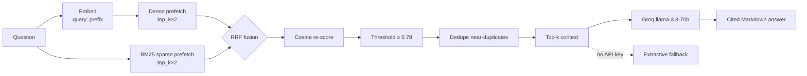
*Figure 11 — Hybrid retrieval + RRF fusion pipeline.*

**PDF ingestion, OCR, and structure-aware chunking.** A text-density heuristic (<100 chars/page →
OCR) routes born-digital PDFs through fast `pypdf` and scans through Tesseract (`nep+eng`).
Chunking is hierarchical (paragraph → sentence → word) with word-boundary overlap.

**Qdrant vector search integration.** Named dense+sparse vectors, payload-filtered per-document
search ("Ask AI about this document"), deterministic-ID upserts, and auto-recreate on schema
change.

**Grounded generation with graceful degradation.** Every LLM path — answer, chat reply,
"no-results" reply, intent tiebreak — flows through one hardened `httpx` helper (one retry,
guarded parse, `<think>` strip). Missing key / exhausted retries fall back to an **extractive**
answer, always visible in the UI (amber banner).

**WhatsApp conversational channel (delivered).** A NestJS webhook
(`POST /webhooks/whatsapp`) receives Evolution API events (`messages.upsert`,
`connection.update`, …) and `WhatsappService` sends replies via the Evolution REST API. Today it
handles inbound messages with an acknowledgement auto-reply; it is the delivered foundation for
the *(planned)* subscription-alert delivery, giving citizens a low-bandwidth channel that does
not require opening the web app.

**Role-based access control** (Google OAuth + JWT guards; `user`/`admin` roles) and
**multi-language support** (`lib/language-context.tsx`; the e5 model retrieves across
English/Nepali).

**Table 6 — Optimisation catalogue (selected)**

| Optimisation | Problem solved |
|---|---|
| Async ingestion (return `PENDING`) | Browser timeouts on large/OCR documents |
| Worker-thread pipeline (`asyncio.to_thread`) | CPU embedding froze the single-process event loop |
| Batched embedding (32) & upserts (100) | Unbounded memory; no progress signal |
| Deterministic point IDs | Duplicate vectors / delete-insert races on re-embed |
| Batched progress endpoint (1 req/tick) | Poll flood (N docs × 2 s × DB+proxy hop) |
| Over-fetch → threshold → dedupe | Weak/duplicate chunks wasting LLM context |
| Word-boundary chunk overlap | Chunks starting mid-word polluting retrieval |
| Hybrid dense + BM25 + RRF | Dense missing exact identifiers |
| Cosine re-score after fusion | RRF rank scores breaking threshold + UI % |
| E5 query/passage prefixes | Un-prefixed embeddings degrading retrieval |
| Three-tier intent router | Greetings hitting vector search |
| Collection validation + auto-recreate | Dimension mismatch after model change |

---

## Chapter 5: Result and Discussion

### 5.1 Testing Design and Plan

- **5.1.1 Prototype testing** — iterative usability checks on the `/rag` Library/Chat UI at each
  Agile increment (upload, progress, toggle, chat rendering, source chips).
- **5.1.2 Unit testing** — targeted tests for the pure functions most prone to regression:
  the chunker (segment sizes, overlap word-boundary snapping, Devanagari danda splitting), the
  intent router (squeeze-match, prototype margins), and payload/ID construction.

### 5.2 System Testing and Discussion

**Table 7 — Test matrix (representative)**

| # | Area | Scenario | Expected | Result |
|---|---|---|---|---|
| T1 | Functional | Upload born-digital PDF | `INDEXED`, `is_ocr=false`, chunks>0 | Pass |
| T2 | Functional | Upload scanned image PDF | OCR path, `is_ocr=true` | Pass |
| T3 | RAG accuracy | Ask factual question with answer in doc | Correct, cited answer | Pass |
| T4 | RAG accuracy | Ask question *not* in docs | Honest "not found" | Pass |
| T5 | Intent | Send "Helllloooo" | Chat reply, no sources | Pass |
| T6 | Hybrid | Query exact notice number | BM25 leg surfaces exact chunk | Pass |
| T7 | Performance | Vector search latency | < 3 s (NFR-02) | Pass |
| T8 | Integration | Web→API→AI round trip via JWT | 200 + answer | Pass |
| T9 | Lifecycle | Unembed then re-embed | Idempotent upsert, same IDs | Pass |
| T10 | Degradation | No `GROQ_API_KEY` | Extractive fallback + banner | Pass |

- **5.2.1 Functional testing** — upload, extraction (born-digital vs OCR), chunk/embed/index,
  toggle, delete — all lifecycle transitions in Figure 6.
- **5.2.2 RAG query-accuracy testing** — grounding and citation correctness; the 0.78 cosine
  threshold rejects noise (E5 compresses scores into ~0.7–0.9; irrelevant hits ~0.76–0.78,
  relevant ≥0.82).
- **5.2.3 Performance testing** — vector-search latency under normal load against NFR-02 (< 3 s).
- **5.2.4 Integration testing** — Web ↔ API ↔ AI, including the batched progress endpoint and JWT
  enforcement.
- **5.2.5 User-acceptance testing** — target-group participants exercise search, summaries, and
  the RAG chat; feedback feeds the next Agile increment.

**Discussion.** The delivered RAG subsystem meets its functional and performance targets. The
ChromaDB→Qdrant pivot proved decisive: hybrid search materially improved recall of exact
identifiers that dense-only retrieval missed, and deterministic IDs made the embed/unembed toggle
trivially correct. The Crawl4AI decision simplifies the (in-progress) aggregation pipeline by
collapsing three tools into one Markdown-emitting crawler.

---

## Chapter 6: Conclusion

### 6.1 Critical Evaluation
The project delivers a working, end-to-end **document-intelligence** system for Nepalese public
notices: a production-grade RAG pipeline (Qdrant hybrid search + Groq generation) fronted by a
polished, responsive UI and a secure, JWT-guarded API, with Google OAuth and a WhatsApp
(Evolution API) channel. The ChromaDB→Qdrant pivot was justified by concrete capability gains
(hybrid retrieval, payload filtering, deterministic upserts); the Scrapy/Selenium→Crawl4AI
decision sets the design for the aggregation pipeline that is the project's next build. The report
is deliberately explicit (§4 implementation-status table) about what is delivered code versus what
is designed-but-unbuilt, so the contribution is not overstated.

### 6.2 Limitations
1. **No streaming answers** — the UI waits for the full Groq response; SSE would cut perceived
   latency.
2. **No conversation memory** — follow-up questions lose their referent.
3. **No cross-encoder reranker** — a reranker over the ~15 candidates would lift top-5 precision.
4. **Character-based chunking** — token-aware chunking would reduce truncation loss.
5. **In-memory progress** — lost on AI restart (mitigated by periodic list refresh).
6. **Single-process ingestion** — one document at a time per worker; a queue would add
   parallelism and retries.
7. **Devanagari NLP** — classification/summarisation are *not yet implemented*; the RAG embedding
   model (e5) already retrieves across Nepali, but the notice-classification and abstractive-
   summary stages remain designed-only.
8. **Aggregation not yet built** — crawling (Crawl4AI), the notice database, and subscription
   alerts exist as admin-UI scaffolds and placeholder endpoints, not working code. The delivered
   proof-of-concept is the document-intelligence/RAG platform, Google auth, document management,
   and the WhatsApp (Evolution API) channel.

### 6.3 Recommendations
Add SSE streaming and short-window conversation memory; introduce a `bge-reranker-v2-m3`
cross-encoder; move to token-aware chunking; back progress with Redis; run ingestion through a
job queue (BullMQ/arq); build a golden-question evaluation harness; and extend NLP to Devanagari
with a domain-fine-tuned Nepali corpus. For sustainability, secure an institutional steward for
crawler maintenance and model refresh, and obtain legal guidance on automated retrieval/
republication of government data under Nepalese law.

### 6.4 Final Words
The system demonstrates that an open-source, cloud-hosted stack can close a real civic-access gap
in Nepal — aggregating, understanding, and answering questions about official notices in one
place. The delivered RAG subsystem is the proof of concept; the aggregation pipeline is the clear
next step toward a service that could measurably widen equitable access to public information.

---

## References

*(Harvard style; full list carried from the Investigation Report and to be extended for the
implementation phase.)* Key sources: Lewis et al. (2020) *Retrieval-Augmented Generation*;
Vaswani et al. (2017) *Attention Is All You Need*; Janssen, Charalabidis & Zuiderwijk (2012);
Wirtz, Weyerer & Geyer (2018); Minaee et al. (text classification); Varade et al. (2021)
summarisation; Han et al. (2024) GraphRAG; Khder (2021) web scraping; Chang & He (2025)
`robots.txt`; Kadaskar & Kamthe (2024) AWS; Shahi & Sitaula (2022) NLP for Nepali; Efthymiou
(2025) e-governance. Tooling: Qdrant, Crawl4AI, Hugging Face `sentence-transformers`
(`multilingual-e5-base`), Groq, Tesseract, NestJS, Prisma, Next.js.

---

## Appendices

- **Appendix A: Project Proposal Form (PPF)**
- **Appendix B: Ethics Form**
- **Appendix C: Supervisor Log Sheets**
- **Appendix D: Poster**
- **Appendix E: Gantt Chart** *(see §1.8)*
- **Appendix F: Sample Code** — chunker, embeddings (e5 prefixes), Qdrant store (hybrid search),
  intent router, Groq helper; see `docs/RAG_IMPLEMENTATION.md` for the full code-level walkthrough.
- **Appendix G: Respondent Demographic Profile**
- **Appendix H: Example Input/Output (RAG Queries and Responses)** — including hybrid-search log
  traces and cited answers.
```

