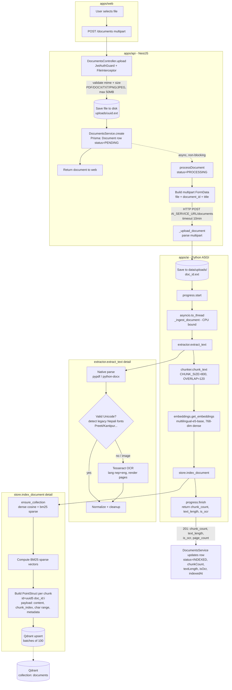
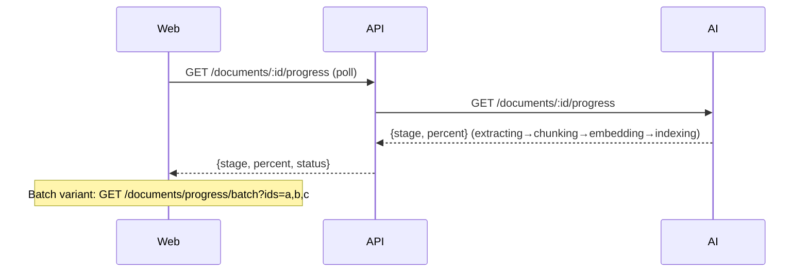
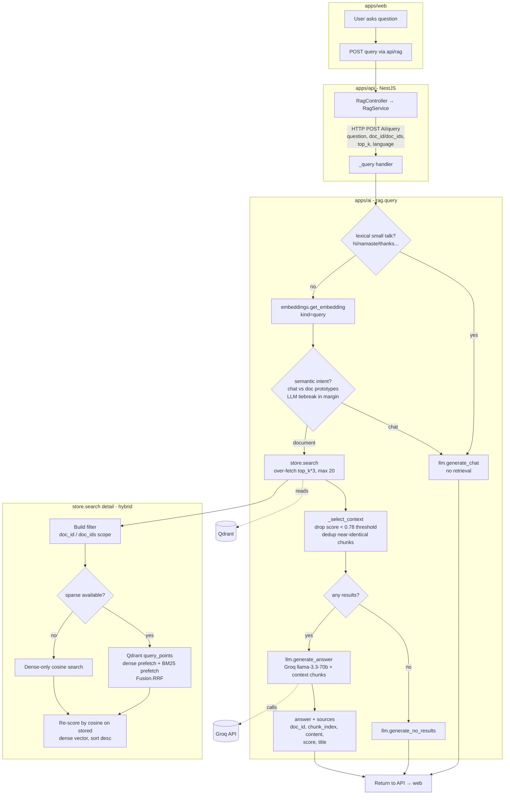

# Document (RAG) Pipeline

This document describes how a document travels from upload to being queryable via
RAG across the three services in the monorepo:

- **web** (`apps/web`) — Next.js frontend, upload UI + chat UI
- **api** (`apps/api`) — NestJS backend, owns document records + proxies to AI
- **ai** (`apps/ai`) — Python ASGI service, does extraction, embedding, retrieval, generation
- **Qdrant** — vector store (dense + BM25 sparse), **Groq** — LLM for answer generation

There are two flows: **Ingestion** (indexing a document) and **Query** (asking questions).

---

## 1. Ingestion Pipeline



### Progress polling (runs in parallel with ingestion)



**Stages emitted** by `progress.update`: `extracting` → `chunking` → `embedding`
(per-chunk %) → `indexing` (per-batch %) → `done` (or `failed`).

---

## 2. Query (RAG) Pipeline



---

## Key Configuration (`apps/ai/app/config.py`)

| Setting | Default | Purpose |
|---|---|---|
| `EMBEDDING_MODEL` | `intfloat/multilingual-e5-base` | Dense embeddings (English + Nepali) |
| `EMBEDDING_DIM` | `768` | Must match Qdrant collection vector size |
| `HYBRID_SEARCH` | `true` | Dense + BM25 sparse fused via RRF |
| `SPARSE_MODEL` | `Qdrant/bm25` | Keyword/sparse retrieval |
| `CHUNK_SIZE` / `CHUNK_OVERLAP` | `800` / `120` | Paragraph-aware chunking, word-boundary overlap |
| `RAG_SCORE_THRESHOLD` | `0.78` | Cosine cutoff for retained context |
| `QDRANT_COLLECTION` | `documents` | Vector collection |
| `GROQ_MODEL` | `llama-3.3-70b-versatile` | Answer + chat generation |
| `TESSERACT_LANG` | `nep+eng` | OCR fallback for legacy Nepali fonts |

## Document Status Lifecycle (Prisma)

```
PENDING ──► PROCESSING ──► INDEXED
                 │
                 └──► FAILED
INDEXED ──(unembed)──► UNEMBEDDED ──(embed)──► PROCESSING ...
```

## Notable Design Points

- **Async ingestion**: the API returns the document row immediately; embedding
  happens in the background (`processDocument`) and the client polls progress.
- **CPU work off the event loop**: the AI service runs the OCR/embedding pipeline
  in a worker thread (`asyncio.to_thread`) so progress polls and queries stay responsive.
- **OCR fallback for legacy fonts**: native text is validated for real Unicode; if it
  looks like a legacy Nepali encoding (Preeti/Kantipur), pages are re-read via Tesseract.
- **Hybrid retrieval**: dense (semantic) + BM25 (keyword) prefetch fused with RRF,
  then re-scored by cosine so thresholds/UI relevance stay comparable.
- **Intent routing**: small talk is answered directly (no retrieval) via a lexical
  match, then an embedding-prototype check with an LLM tiebreak.
- **Deterministic point IDs**: `uuid5(doc_id:chunk_index)` makes re-indexing idempotent
  and per-document delete a simple `doc_id` filter.
