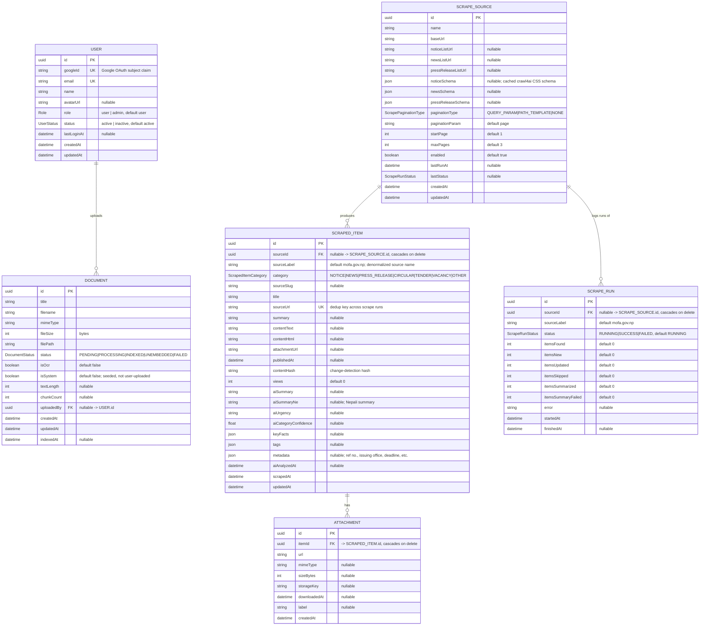

# Entity Relationship Diagram — Public Notice Management

**Database:** PostgreSQL, managed via [Prisma](apps/api/prisma/schema.prisma) (`apps/api`).
**Scope:** notice aggregation, AI enrichment, RAG document store, and auth. There is exactly one bounded context in this schema — no unrelated subsystems.
**Vector index:** chunk embeddings for RAG live in **Qdrant**, outside Postgres — see [External Systems](#external-systems).

> Generated from `apps/api/prisma/schema.prisma`. Keep this file in sync whenever the schema changes.

---

## Diagram

---

## Legend

| Notation | Meaning |
|---|---|
| `PK` | Primary key |
| `FK` | Foreign key |
| `UK` | Unique constraint |
| `\|\|--o{` | One-to-many (crow's foot): exactly one on the left, zero-or-more on the right |
| `Type` in caps (`Role`, `DocumentStatus`, …) | Prisma enum — allowed values noted in the attribute comment |

## Relationships

| Relationship | Cardinality | On delete | Notes |
|---|---|---|---|
| `User → Document` | 1 : N | `RESTRICT` (default) | `uploadedBy` is nullable — system-seeded documents (`isSystem=true`) have no owning user |
| `ScrapeSource → ScrapedItem` | 1 : N | `CASCADE` | `sourceId` nullable — legacy/manually-seeded items use free-text `sourceLabel` instead |
| `ScrapeSource → ScrapeRun` | 1 : N | `CASCADE` | Same nullable-source pattern as above |
| `ScrapedItem → Attachment` | 1 : N | `CASCADE` | Deleting a notice removes its attachments |

## External Systems

- **Qdrant (vector DB)** — `apps/ai/app/store.py` maintains a hybrid (dense + sparse) vector collection keyed by `doc_id` / `chunk_index`, one point per document chunk. This is the RAG index backing `DOCUMENT` rows (`textLength`, `chunkCount`, `status` in Postgres mirror what's indexed in Qdrant) and is not itself relational, so it isn't modeled above.
- **Frontend types** (`apps/web/lib/types.ts`) mirror these API DTOs closely (`RagDocument` ↔ `DOCUMENT`, `ScrapedItem` / `PublicNoticeDetail` ↔ `SCRAPED_ITEM` + `ATTACHMENT`, plus `ScrapeSource`, `ScrapeRun`). A handful of types (`AlertRule`, `Activity`, `ScrapingSource`) exist only in the web app's localStorage mock layer (`lib/local-store.ts`, `lib/mock-data.ts`) with no backing table yet — part of the local-only mode described in `CLAUDE.md`.
